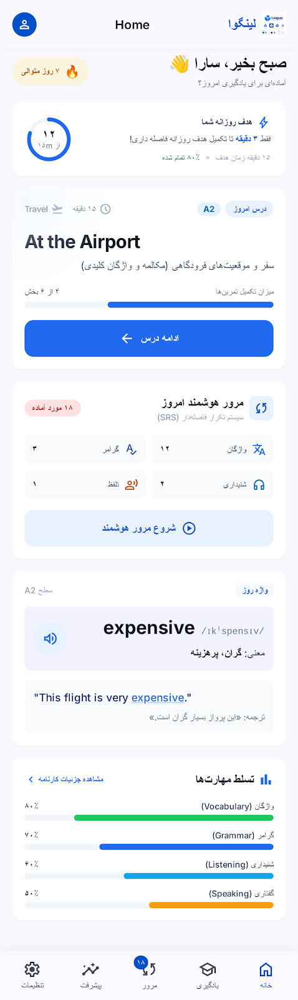
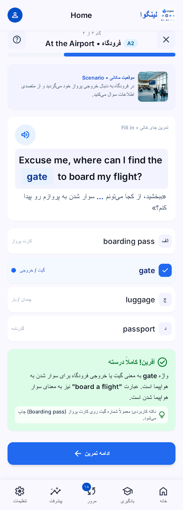
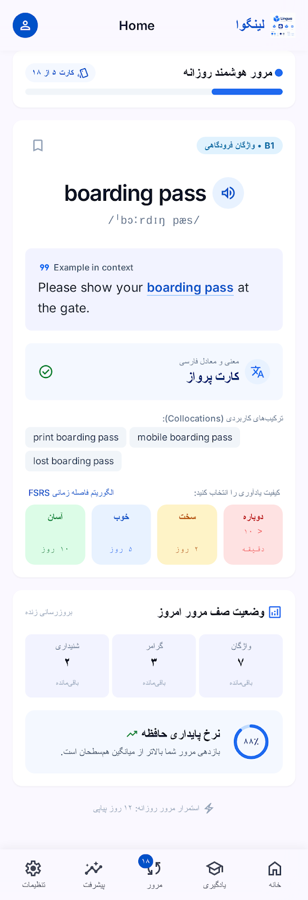
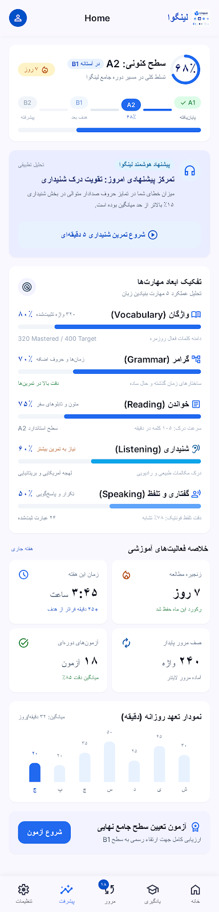
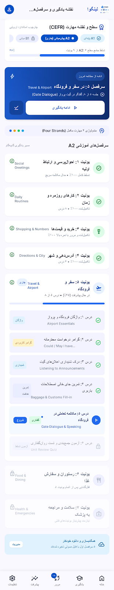
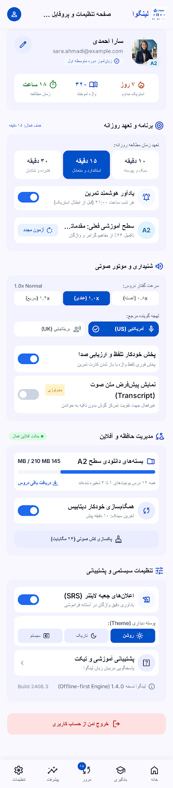

# Lingo — English Learning (A1–C2)

> اپ اندروید **آفلاین‌محور** برای فارسی‌زبانانی که انگلیسی یاد می‌گیرند:
> درس روزانه → تمرین → مرور فاصله‌دار → پیشرفت.
> هستهٔ یادگیری کامل روی دستگاه کار می‌کند و بدون اینترنت هم باید کار کند.

An offline-first Android app for Persian speakers learning English (CEFR A1–C2):
daily lessons → exercises → spaced-repetition review → progress.

| | |
|---|---|
| Gradle project | `English` |
| Application id | `org.token.english` |
| Display name | English |
| Min / target / compile SDK | 24 / 37 / 37 |
| Language & UI | Kotlin + Jetpack Compose (forced RTL) |
| Local storage | Room (schema v4, exported) + DataStore Preferences |

The learner UI is entirely Persian; all English content is rendered through components that
re-assert LTR, because the root layout is forced RTL.

---

## Contents

- [What is in the app today](#what-is-in-the-app-today)
- [Design preview](#design-preview)
- [Build and run](#build-and-run)
- [Project layout](#project-layout)
- [Content pipeline](#content-pipeline)
- [Testing](#testing)
- [Connectivity](#connectivity)
- [Known limitations](#known-limitations)
- [Roadmap](#roadmap)
- [Contributing](#contributing)
- [Documentation](#documentation)
- [License](#license)

---

## What is in the app today

**Learning flow**

- **Placement test** — 36 questions in six graded bands of six (A1→C2), including one reading
  comprehension item per band so the test measures reading alongside grammar and vocabulary (A-6).
  Scoring is band-based: a
  band passes at ≥ 2/3 with ≥ 60 % cumulative accuracy, scoring stops at the first failed band, and
  the result floors at A1. It doubles as a per-skill assessment (P1-1): each question carries an authored skill, so the result screen shows a per-skill read and the placement answers calibrate the learner's skill profile from day one.
- **Foundations first** — the alphabet and letter names, spelling your name, and numbers 0–100 are the
  first three A1 lessons, so a complete beginner meets letters before words. Greetings now sits
  behind the alphabet in the curriculum graph.
- **Lessons** — an intro stage (word list, short Persian grammar tip, optional audio) followed by
  exercises. A wrong answer shows a short explanation and re-asks that same item once in the same
  session, so a miss is never just a score.
- **Exercises** — `multiple_choice`, `fill_blank`, `translation`, `listening`. Multiple-choice
  options are shuffled deterministically per question id (fixed seed), so the answer position never
  leaks. `speaking` parses but is not implemented.
- **Review** — SM-2-lite spaced repetition with a daily new-card cap (20) and calendar-day anchors
  instead of raw 24-hour multiples. Odd-numbered cards ask for active production: a Persian prompt,
  typed English answer. `AGAIN` re-queues inside the session (at most twice).
- **Listening** — read aloud by the on-device Android TTS engine. No audio files, no network.
- **Vocabulary browser** — search with escaped `LIKE` patterns.
- **Progress** — per-skill mastery, streaks, review accuracy, and knowledge-node coverage.
- **Daily reminder** — inexact daily alarm; asks for `POST_NOTIFICATIONS` on Android 13+.

**Learner model**

Mastery is tracked twice, on purpose, and both use the same engines:

- per **skill** (vocabulary, grammar, listening, speaking, reading, writing) — an exponentially
  weighted average, seeded by the first observation;
- per **knowledge item** — 72 curriculum nodes carrying prerequisites, mastery, exposure counts and
  their own review schedule. `KnowledgeGraph` orders and unlocks the graph; every graded lesson
  answer is attributed to the nodes its lesson teaches and written with an atomic
  read-modify-write.

`DefaultKnowledgeEngine` reuses the same SM-2 scheduler for intervals/ease and the same mastery
engine as the skill meters, so "known" cannot mean two different things in two screens.

**Content bundle (JSON `contentVersion` 20)**

| | Count |
|---|---|
| Lessons | 48 — A1: 15, A2: 7, B1/B2: 6 each, C1/C2: 7 each |
| Exercises | 441 |
| Vocabulary entries | 290 |
| Knowledge items | 89 |
| Placement questions | 36 |

The bundle is authored data only: extending it needs **no Kotlin change**, just JSON plus a bump of
`contentVersion`, which is declared inside the files themselves.

**Subscription**

All content is subscription-gated with a **7-day free trial**; plans are `sub_monthly` and
`sub_yearly`. Access is decided by a pure, unit-tested `EntitlementPolicy` (SUBSCRIPTION →
COMPANION_APP → TRIAL → LOCKED). Each release build targets one market and embeds only that
market's billing SDK:

| Flavour | Store | SDK |
|---|---|---|
| `bazaar` | کافه‌بازار | Poolakey 2.2.0 (real subscriptions) |
| `myket` | مایکت | myket-billing-client 1.19 (Myket has no subscriptions — plans are consumables with a local expiry) |
| `googlePlay` | Google Play | Play Billing 9.1.0 |

The trial is measured with wall-clock time plus `elapsedRealtime` checkpoints, so moving the device
clock does not hand out extra trial time.

**Free with the Zaribar app:** while the companion app `org.token.zaribar` is installed, the
subscription is free — the grant is re-checked on every foreground and ends when the companion is
removed. The install is trusted only when its signing certificate matches
`CompanionApp.EXPECTED_SIGNING_SHA256` (the package id alone would be spoofable). The app shows a
Cafe Bazaar download link (`bazaar://details?id=org.token.zaribar`) so the learner can keep it
installed. The check is a single local `PackageManager` lookup: no server, no permission, and it is
declared in the manifest `<queries>` block for API 30+ visibility.

---

## Design preview

These are the original design mockups, kept in `files/` as design intent — not screenshots of the
running app. The built UI follows them through the shared design-system tokens rather than by
copying pixels.

| Home | Lesson | Review |
|---|---|---|
|  |  |  |

| Progress | Roadmap | Settings |
|---|---|---|
|  |  |  |

The brand board is at
[`lingua_english_learning_brand_board.png`](files/stitch_english_learning_app_design_system/lingua_english_learning_brand_board.png/screen.png).

---

## Build and run

The everyday loop is **tests, not APKs**. Compiling all three flavours after every change is slow
and buys nothing — do it at release points or when putting a build on a device.

### Requirements

- **JDK 25** — the version the project is verified against. Gradle runs on the JVM you launch it
  with; the foojay toolchain resolver in `settings.gradle.kts` can provision a missing toolchain.
- **Android SDK** with platform **37** and matching build-tools, plus `platform-tools` for ADB.
  Point the build at it with `sdk.dir` in an untracked `local.properties`.
- **No local Gradle install** — always use the wrapper (`./gradlew`), which pins Gradle 9.5.0.
- A device or emulator is only needed for instrumented tests or manual UI checks; the unit-test gate
  runs on the JVM alone.
- Optional: `keystore.properties` for release signing and the marketplace billing keys.

```bash
# Fast gate: unit tests, and a typecheck of the main sources that comes for free.
./gradlew :app:testBazaarDebugUnitTest

# Content gate: validates every bundled JSON file (also runs in preBuild).
./gradlew validateContent
```

Only per-flavour unit-test tasks exist (`testDebugUnitTest` is not a task under AGP 9's
`onlyEnableUnitTestForTheTestedBuildType`).

**On a real device** — builds and installs only when a device is actually attached, and exits
quietly with no build when none is:

```bash
scripts/install_debug.sh                 # bazaar (default); or myket | googlePlay
scripts/install_debug.sh --list-devices
```

**Release points**

```bash
./gradlew :app:assembleBazaarDebug      # Cafe Bazaar APK
./gradlew :app:assembleMyketDebug       # Myket APK
./gradlew :app:assembleGooglePlayDebug  # Google Play APK
```

**CI** (`.github/workflows/ci.yml`) runs the two fast gates (content validation + unit tests) and
`lintBazaarDebug` on every push and pull request; the three flavor assemblies run on a schedule,
manual dispatch or a tag, because building every flavor on every commit buys nothing.

### Toolchain

Verified October 2026 — do not "fix" these casually:

- AGP **9.3.3** + Gradle **9.5.0**, JDK toolchain **25** (Kotlin falls back to JVM 24 target).
- **Built-in Kotlin** (AGP 9 default): never apply `org.jetbrains.kotlin.android`.
- KSP `2.2.10-2.0.2` must match the built-in KGP `2.2.10`; `composeCompiler` must equal the built-in
  Kotlin version too.
- `android.disallowKotlinSourceSets=false` in `gradle.properties` is required for KSP's generated
  sources under built-in Kotlin.
- Only per-flavour build types are enabled for unit tests, as noted above.

### Release signing

`keystore.properties` is **untracked and must stay that way**. It holds
`storeFile`/`storePassword`/`keyAlias`/`keyPassword` plus the marketplace keys `bazaarRsaKey` and
`myketPublicKey`. A Cafe Bazaar release build **fails deliberately** when `bazaarRsaKey` is empty,
because Poolakey would otherwise silently run with signature verification disabled.

---

## Project layout

```
app/src/main/java/org/token/english
├── MainActivity.kt              Compose host: theme gate + forced RTL root
├── EnglishApp.kt                Application → AppContainer, seeding, reminder and trial ticks
├── navigation/                  Routes + NavHost + bottom bar
├── core/
│   ├── designsystem/            Colour/type/shape/spacing tokens + shared components
│   ├── billing/                 BillingGateway, EntitlementPolicy (pure), TrialClock
│   ├── audio/                   AudioPlayer interface + on-device TTS implementation
│   └── common/                  TimeUtil (day keys, streaks), SafeCatching
├── domain/                      PURE KOTLIN — no Android, no Room, no Compose
│   ├── model/                   Lesson, VocabularyItem, Exercise, KnowledgeItem, AnswerChecker
│   ├── repository/              Repository interfaces (implemented in data/)
│   ├── engine/                  ReviewScheduler, MasteryEngine, LearningPlanner,
│   │                            KnowledgeGraph, KnowledgeEngine, KnowledgeEvidence
│   └── usecase/                 SubmitExercise, CompleteLesson, SubmitReview, GetTodayPlan, …
├── data/
│   ├── local/                   Room: entities, DAOs, AppDatabase (v4, schemas exported)
│   ├── content/                 ContentParser (org.json) + ContentSeeder (assets → Room)
│   └── repository/              Repository implementations + SettingsRepositoryImpl (DataStore)
├── di/AppContainer.kt           Manual DI container
└── feature/<screen>/            Screen + ViewModel per feature, incl. paywall/
app/src/{bazaar,myket,googlePlay}/java/org/token/english/billing/PlatformBillingGateway.kt
```

### Dependency rule

```
feature → domain (models + usecases) + core/designsystem + di
domain  → nothing Android (pure Kotlin only)
data    → domain (implements the interfaces) + Room/DataStore
```

- UI state is always `UiState (StateFlow) ← Event ← ViewModel ← UseCase/Repository`. ViewModels never
  touch Room or DataStore directly, and composables contain no business logic.
- DI is manual (`AppContainer`). Hilt was deliberately skipped — its plugin/KSP interaction under
  AGP 9's built-in Kotlin adds risk for no MVP value.
- A ViewModel takes only the repositories, use cases and seams it actually uses — never the whole
  container. `di/ViewModelFactories.kt` is the single place the container meets a ViewModel, and the
  only `di/` symbol a screen imports is its own `*ViewModelFactory()` (B-6). Narrow constructors are
  what make ViewModel tests possible without Android.
- Engines are pure and swappable. The UI must never learn how intervals or mastery are computed.

### How a screen gets its data

```
Composable (feature/<screen>/…Screen.kt)
      │  emits Events
      ▼
ViewModel  ── StateFlow<UiState> ──▶ recomposition (state is the single source of truth)
      │  calls use cases / repositories
      ▼
domain/usecase ──▶ domain/engine   (pure: ReviewScheduler, MasteryEngine,
      │                             LearningPlanner, KnowledgeGraph, KnowledgeEngine)
      ▼
domain/repository (interfaces)
      │  implemented by
      ▼
data/repository ──▶ Room (local) + DataStore (preferences)   ← the whole learning core
      │
      └─▶ core/billing BillingGateway → the flavour's PlatformBillingGateway → store SDK
                                                                            (the only network path)
```

---

## Content pipeline

Source of truth: `app/src/main/assets/content/`

| File | Defines |
|---|---|
| `lessons.json` | Lessons, CEFR level, order, Persian grammar tip |
| `vocabulary.json` | Words, translation, IPA, two bilingual {en, fa} examples each, collocations |
| `exercises.json` | The exercises (authored JSON payloads) |
| `placement.json` | The banded placement questions |
| `knowledge.json` | The curriculum graph: nodes, prerequisites, taught lessons, skills |

`ContentSeeder` runs at app start and re-seeds only when the JSON `contentVersion` differs from the
stored one; the clear-and-insert runs in a single Room transaction, so a crash can never leave a
half-seeded database.

`./gradlew validateContent` is the gate, and runs before every build. The JSON pipeline cannot see
content mistakes at compile time, so without it a dangling `lessonId` silently orphans a lesson, an
out-of-range `correctIndex` only throws mid-lesson, and a duplicate id is dropped by Room without a
word. The task checks ids, references, CEFR levels, exercise types, answer keys, blank markers,
non-empty accepted answers, duplicate words within a lesson, bundle-version agreement, full lesson
coverage, and that the prerequisite graph has **no cycles**. It reports every problem at once rather
than stopping at the first.

Adding content is therefore JSON only. Correct-answer positions are kept balanced across the option
slots by `scripts/balance_answer_positions.mjs`, and `ContentDistributionTest` enforces it.

---

## Testing

```bash
./gradlew :app:testBazaarDebugUnitTest
```

252 unit tests across 36 classes. The pure cores carry the most weight — review scheduling,
mastery and answer checking, streak day keys, entitlement policy and trial clock, placement scoring
and its per-skill assessment, the content pipeline, the curriculum graph and the knowledge engine —
and every decision engine (planner, prerequisites, remediation, mastery profile, exercise selector)
has its own tests. `LearningPathJourneyTest` runs the whole learner journey on the real bundle with
in-memory repositories, so the pieces are proven to compose, not just to work alone. The first
ViewModel tests (B-6) drive `Home`/`Lesson`/`Review` through in-memory fakes — companion gating, the
requeue-once-on-a-miss rule, the TTS-unavailable fallback and the review lifecycle — with no
Android, no Room and no device. The adaptive layer runs on real screens too (B-1): Home shows the
remediation engine's weak spot and its CTA opens a focused session that drills only the exercises
which are evidence about that node, while every session orders its queue by the kind of knowing the
learner's own answers showed to be weakest.

Content tests read the assets through `File`, so Gradle cannot see them as inputs — after a content
edit run them with `--rerun`, or they silently report `UP-TO-DATE`.

Instrumented tests are still the Android Studio templates and are not maintained. UI changes rely on
manual verification on a device.

---

## Connectivity

The app is **offline-first, not offline-only**. The learning core runs entirely from Room and
DataStore and must keep working with no network at all. `INTERNET` is currently used only by in-app
billing, and the only network code paths are the billing SDKs.

Suspended — needs backend/server infrastructure, not just connectivity:

- AI conversation / AI feedback
- Cloud sync, authentication, backup
- Downloadable content packages
- Analytics upload

Allowed but not built yet: on-device speech evaluation, remote crash reporting.

Any new online feature must state which service it calls and why, must degrade gracefully when
offline, and must not block the learning core.

---

## Known limitations

- **Myket has no real subscriptions.** Expiry is local and lost on reinstall; a user claiming a lost
  subscription must re-prove the purchase through support.
- `bazaarRsaKey` unset disables Poolakey verification — release builds refuse to ship in that state.
- Persian UI strings live inline in composables; extracting them to `strings.xml` is open design
  debt until a second locale appears.
- Room is at `version = 5` with exported schemas in `app/schemas`. Schema changes must ship a
  migration **and** be registered in `AppContainer.database` — Room throws at open time when a path
  from the installed version is missing, so a forgotten `addMigrations` crashes upgrading installs.
- Due counts capture `now` when the collection starts, so a long-running session will not see newly
  due items until the ViewModel is recreated.
- Studied seconds are credited on screen close/finish (best effort), not by a foreground timer.
- A streak day requires at least 60 seconds of study.
- Single `:app` module; split it when build times or ownership demand it.

---

## Roadmap

Nothing here is committed to a date; it is the order in which the pieces make sense.

**Buildable offline (no backend required)**

- Move the spaced-repetition queue onto the knowledge graph — schedule and re-serve each due
  curriculum node's own exercises, and feed review grades into node mastery the way lesson answers
  already do.
- An error taxonomy so each miss is classified (vocabulary gap vs grammar vs comprehension) and
  drives what comes next — then adaptive difficulty on top of it.
- `writing` and `conversation` exercise types (the exercise model already has room for them).
- On-device speech evaluation for the `speaking` exercise, which currently renders as inactive.
- Remote crash reporting — a deliberate provider and privacy decision, not a default.

**Suspended until a backend exists**

AI conversation and feedback, cloud sync / authentication / backup, downloadable content packages,
and analytics upload. [`AGENTS.md`](AGENTS.md) §4 explains the reasoning and the seams already left
in place for each.

**Infrastructure**

- CI that runs the unit-test gate and `validateContent` on every push (there is none today).

---

## Contributing

[`AGENTS.md`](AGENTS.md) is the authoritative reference — read it before changing anything. The
short version:

- **Run the gates locally.** CI runs them too, but a red pipeline is a slow way to learn:
  `./gradlew :app:testBazaarDebugUnitTest`, and `./gradlew validateContent` after any content edit.
- **Content is data, not code.** Add lessons, words, exercises and knowledge nodes in the JSON
  bundle and bump `contentVersion`; new content needs no Kotlin change.
- **Respect the layers.** `domain/` stays pure Kotlin (no Android, no Room, no Compose), and the UI
  never learns how intervals or mastery are computed.
- **Use the design tokens.** Never hardcode colours, spacings or radii; Persian strings live inline
  in composables and English text goes through the LTR components.
- **Offline stays sacred.** The learning core must keep working with no network, and anything that
  needs a backend must be confirmed with the maintainer before it is built.
- A change is done when the tests pass, `validateContent` passes if content moved, empty, loading
  and error states exist, RTL/LTR is verified, and no undocumented permission was added.

---

## Documentation

- [`AGENTS.md`](AGENTS.md) — the authoritative reference for anyone (human or agent) working on this
  repository: architecture, conventions, the connectivity policy and the definition of done.
- `files/` — the source design and methodology specs (design system, CEFR curriculum methodology,
  target technical architecture). Treat them as design intent, not proof of implementation.

## License

The bundled **Vazirmatn** font is licensed under the SIL Open Font License — see
[`licenses/Vazirmatn-OFL.txt`](licenses/Vazirmatn-OFL.txt). No license has been chosen for the
application source code in this repository yet.
